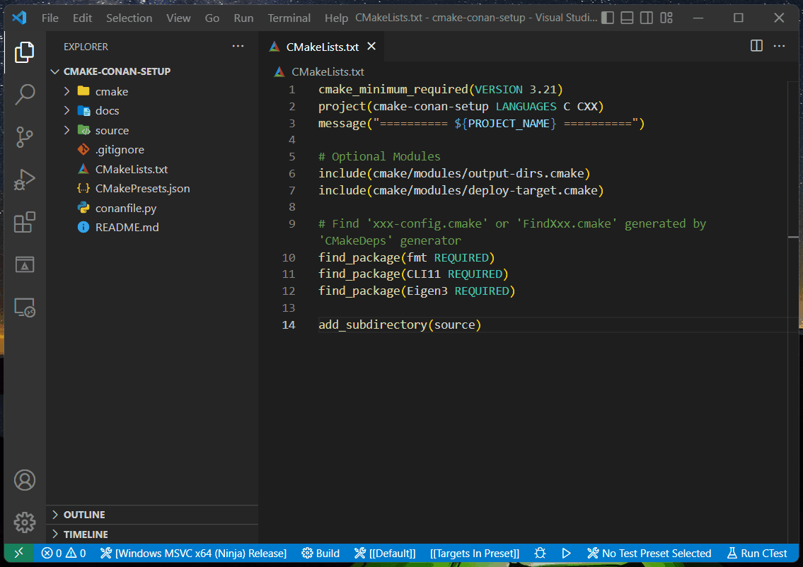

# cmake-conan-setup

CMake toolchain for integration with Conan using [cmake-conan](https://github.com/conan-io/cmake-conan), [`conan-setup.cmake`](./conan-setup.cmake).

> NOTE:
>
> - Since [CMakeDeps](https://docs.conan.io/en/latest/reference/conanfile/tools/cmake/cmakedeps.html) and [CMakeToolchain](https://docs.conan.io/en/latest/reference/conanfile/tools/cmake/cmaketoolchain.html) will be the only two cmake-related generators supported in Conan 2.X, this project won't consider the situation using any other cmake-related generators although the demonstration is using Conan 1.X.
> - This project is INCOMPATIBLE with Conan 2.x for now since there are some bugs about `conan_cmake_autodetect()`...etc. Theoretically, this project should work with Conan 2.X after those bugs are fixed, which is the main goal of this project.

## Motivation

This project aims to provide a **NONINTRUSIVE** way to integrate CMake with Conan using cmake-conan. It is because the typical usage of cmake-conan is intrusive, which uses APIs of cmake-conan inside the `CMakeLists.txt` directly. For example:

<details><summary>Click to expand</summary>

```cmake
cmake_minimum_required(VERSION 3.9)
project(FormatOutput CXX)

list(APPEND CMAKE_MODULE_PATH ${CMAKE_BINARY_DIR})
list(APPEND CMAKE_PREFIX_PATH ${CMAKE_BINARY_DIR})

add_definitions("-std=c++11")

if(NOT EXISTS "${CMAKE_BINARY_DIR}/conan.cmake")
  message(STATUS "Downloading conan.cmake from https://github.com/conan-io/cmake-conan")
  file(DOWNLOAD "https://raw.githubusercontent.com/conan-io/cmake-conan/0.18.1/conan.cmake"
                "${CMAKE_BINARY_DIR}/conan.cmake"
                TLS_VERIFY ON)
endif()

include(${CMAKE_BINARY_DIR}/conan.cmake)

conan_cmake_configure(REQUIRES fmt/6.1.2
                      GENERATORS cmake_find_package)

conan_cmake_autodetect(settings)

conan_cmake_install(PATH_OR_REFERENCE .
                    BUILD missing
                    REMOTE conancenter
                    SETTINGS ${settings})

find_package(fmt)

add_executable(main main.cpp)
target_link_libraries(main fmt::fmt)
```

</details>

Moreover, there's an important problem that made Conan 2.X decide to deprecate cmake-conan, which is the **Chicken-And-Egg(CAE)** problem with CMakeToolchain (See more details on this [issue](https://github.com/conan-io/cmake-conan/issues/447)). Therefore, this project provides an alternative way to use cmake-conan, which can solve the CAE problem.

## Usage

Users just need to do the following two things:

- Prepare a conan recipe (`conanfile.txt` or `conanfile.py`) in the root source directory.
- Specify cache variable [CMAKE_PROJECT_INCLUDE_BEFORE](https://cmake.org/cmake/help/latest/variable/CMAKE_PROJECT_INCLUDE_BEFORE.html) with [`conan-setup.cmake`](./conan-setup.cmake).

And then, all the installation of dependencies will be **DONE** automatically when they configure their projects.

You can grab a specific version of `conan.cmake` from cmake-conan to your project alongside with `conan-setup.cmake`. Otherwise, `conan-setup.cmake` will download the lastest version of `conan.cmake` from the master branch of cmake-conan.

## Mechanism

The idea of this project is inspired by this [article](https://www.qt.io/blog/qt-creator-cmake-package-manager-auto-setup) of Qt Blog, which introduces a custom toolchain file called `auto-setup.cmake` (You can check its content [here](https://code.qt.io/cgit/qt-creator/qt-creator.git/plain/src/share/3rdparty/package-manager/auto-setup.cmake)). After simplifying the file and replacing the old APIs of cmake-conan with the new one into [`conan-setup.cmake`](./conan-setup.cmake), there are 4 steps of the mechanism:

1. Include `conan.cmake` and scan for conan recipes in the root source directory.
2. Create a new `CMakeLists.txt`, in which APIs of cmake-conan are used, by calling `file(WRITE)`.
3. Configure the generated `CMakeLists.txt` by calling `execute_process(COMMAND ${CMAKE_COMMAND})`.
4. Include `conan_toolchain.cmake` generated by CMakeToolchain at the end of `conan-setup.cmake`.

Therefore, we can include `conan_toolchain.cmake` **BEFORE** the invocation of the first `project()` command. As we can see, the mechanism successfully solves the CAE problem.

## Cache Variables

There are some default or custom variables that will take effect in [`conan-setup.cmake`](./conan-setup.cmake).

| Cache Variables                                                                                       | Default Value</br>(if not specified) | Effects                                                                                                                                            |
| ----------------------------------------------------------------------------------------------------- | ---------------------------------------- | -------------------------------------------------------------------------------------------------------------------------------------------------- |
| [CMAKE_CONFIGURATION_TYPES](https://cmake.org/cmake/help/latest/variable/CMAKE_CONFIGURATION_TYPES.html) | `Debug;Release`                        | If you're using Multi-Config generators, then it will run `conan install` command with all the config types listed in this variable recursively. |
| CMAKE_CONAN_OUPTUT_FOLDER                                                                             | `conan-deps`                   | The subfolder where `conan install` command generates files inside the build directory.                                                          |
| CMAKE_CONAN_OUTPUT_QUIET                                                                              | `false`                                | Disable the output message of running `conan install` command if we set it to `true`.                                                          |
| CMAKE_CONAN_ERROR_QUIET                                                                               | `false`                                | Disable the error message of running `conan install` command if we set it to `true`.                                                           |

## Prerequisites

- CMake (at least version **3.23** for using some features needed in `CMakePresets.json`)
- Ninja (for using `Ninja` or `Ninja Multi-Config` generator)
- C/C++ Compilers

There are some installation guides for your reference:

- [Installation Guide for Windows](docs/install-guide-windows.md)
- [Installation Guide for Linux](docs/install-guide-linux.md)
- [Installation Guide for MacOS](docs/install-guide-macos.md)

## Configure Presets

There are some configure presets in [`CMakePresets.json`](CMakePresets.json). You can run [`cmake --list-presets`](https://cmake.org/cmake/help/latest/manual/cmake.1.html#cmdoption-cmake-list-presets) command to check all the available configure presets for your platform, and then run [`cmake --preset <preset-name>`](https://cmake.org/cmake/help/latest/manual/cmake.1.html#cmdoption-cmake-preset) to configure the project.

### Windows-specific Presets

<details><summary>Click to expand</summary>

```cmd
F:\GitRepo\cmake-conan-setup>cmake --list-presets
Available configure presets:

  "win32-msvc-x64-ninja-debug"      - Windows MSVC x64 (Ninja) Debug
  "win32-msvc-x64-ninja-release"    - Windows MSVC x64 (Ninja) Release
  "win32-msvc-x64-nmake-debug"      - Windows MSVC x64 (NMake Makefiles) Debug
  "win32-msvc-x64-nmake-release"    - Windows MSVC x64 (NMake Makefiles) Release
  "win32-msvc-x64-ninja-multi"      - Windows MSVC x64 (Ninja Multi-Config)
  "win32-msvc-x64-vs2019-multi"     - Windows MSVC x64 (Visual Studio 16 2019)
  "win32-msvc-x86-ninja-debug"      - Windows MSVC x86 (Ninja) Debug
  "win32-msvc-x86-ninja-release"    - Windows MSVC x86 (Ninja) Release
  "win32-msvc-x86-nmake-debug"      - Windows MSVC x86 (NMake Makefiles) Debug
  "win32-msvc-x86-nmake-release"    - Windows MSVC x86 (NMake Makefiles) Release
  "win32-msvc-x86-ninja-multi"      - Windows MSVC x86 (Ninja Multi-Config)
  "win32-msvc-x86-vs2019-multi"     - Windows MSVC x86 (Visual Studio 16 2019)
  "win32-gcc-x64-ninja-debug"       - Windows GCC x64 (Ninja) Debug
  "win32-gcc-x64-ninja-release"     - Windows GCC x64 (Ninja) Release
  "win32-gcc-x64-mingw-debug"       - Windows GCC x64 (MinGW Makefiles) Debug
  "win32-gcc-x64-mingw-release"     - Windows GCC x64 (MinGW Makefiles) Release
  "win32-gcc-x64-ninja-multi"       - Windows GCC x64 (Ninja Multi-Config)
  "win32-gcc-x86-ninja-debug"       - Windows GCC x86 (Ninja) Debug
  "win32-gcc-x86-ninja-release"     - Windows GCC x86 (Ninja) Release
  "win32-gcc-x86-mingw-debug"       - Windows GCC x86 (MinGW Makefiles) Debug
  "win32-gcc-x86-mingw-release"     - Windows GCC x86 (MinGW Makefiles) Release
  "win32-gcc-x86-ninja-multi"       - Windows GCC x86 (Ninja Multi-Config)
  "win32-clangcl-x64-ninja-debug"   - Windows ClangCL x64 (Ninja) Debug
  "win32-clangcl-x64-ninja-release" - Windows ClangCL x64 (Ninja) Release
  "win32-clangcl-x64-ninja-multi"   - Windows ClangCL x64 (Ninja Multi-Config)
  "win32-clangcl-x86-ninja-debug"   - Windows ClangCL x86 (Ninja) Debug
  "win32-clangcl-x86-ninja-release" - Windows ClangCL x86 (Ninja) Release
  "win32-clangcl-x86-ninja-multi"   - Windows ClangCL x86 (Ninja Multi-Config)
  "win32-clang-x64-ninja-debug"     - Windows Clang x64 (Ninja) Debug
  "win32-clang-x64-ninja-release"   - Windows Clang x64 (Ninja) Release
  "win32-clang-x64-ninja-multi"     - Windows Clang x64 (Ninja Multi-Config)
  "win32-clang-x86-ninja-debug"     - Windows Clang x86 (Ninja) Debug
  "win32-clang-x86-ninja-release"   - Windows Clang x86 (Ninja) Release
  "win32-clang-x86-ninja-multi"     - Windows Clang x86 (Ninja Multi-Config)
```

</details>

### Linux-specific Presets

### MacOS-specific Presets

## Demonstrations

> NOTE:
>
> - You need to call `vcvarsall.bat <argument>` to setup environment before configuring the MSVC and ClangCL presets except those using Visaul Studio generator. (Only avaliable in `cmd.exe` not in `powershell.exe`)
> - You may need to modify the `"environment"` settings yourself if the Clang/LLVM or GCC/MinGW Compiler is installed on other locations.

## Integration with IDEs

### Visual Studio Code (CMake Tools)

1. Open the project folder by Visual Studio Code.
2. Install [CMake Tools](https://marketplace.visualstudio.com/items?itemName=ms-vscode.cmake-tools) extension.
3. Type **"CMake: Select Configure Preset"** on Command Palette (`Ctrl+Shift+P`).
4. Type **"CMake: Configure"** on Command Palette (`Ctrl+Shift+P`).


